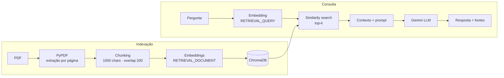

# RAG Knowledge Base

Sistema de perguntas e respostas sobre documentos PDF usando **RAG** (Retrieval-Augmented Generation): busca semântica em banco vetorial + geração de resposta por LLM, com **citação da página de origem** e recusa explícita quando a informação não está nos documentos.


---

## O problema

Um LLM sozinho responde a partir do que memorizou durante o treinamento. Isso traz três limitações práticas:

- **Não conhece seus documentos** — contratos, manuais, políticas internas, papers específicos.
- **Alucina com confiança** — quando não sabe, tende a inventar uma resposta plausível.
- **Não é auditável** — não há como verificar de onde veio a informação.

RAG resolve os três: em vez de confiar na memória do modelo, o sistema **busca** os trechos relevantes nos documentos e entrega esses trechos ao LLM como contexto obrigatório da resposta.

---

## Como funciona



**Indexação** (uma vez por documento): o PDF é lido página a página, dividido em chunks com sobreposição, convertido em vetores pela API do Gemini e persistido no ChromaDB junto com o número da página de origem.

**Consulta** (a cada pergunta): a pergunta vira vetor, o ChromaDB devolve os chunks mais próximos, esses trechos são montados num prompt com regras rígidas de grounding, e o Gemini gera a resposta citando as páginas.

---

## Exemplo real

**Requisição**

```json
POST /query
{
  "question": "Quais são os dois tipos de memória que o RAG combina?",
  "top_k": 2
}
```

**Resposta**

```json
{
  "question": "Quais são os dois tipos de memória que o RAG combina?",
  "answer": "O RAG combina a memória paramétrica e a memória não paramétrica (página 9).",
  "sources": [
    {
      "source": "rag-paper.pdf",
      "page": 2,
      "distance": 0.5278,
      "excerpt": "We combine these components in a probabilistic model trained end-to-end..."
    },
    {
      "source": "rag-paper.pdf",
      "page": 9,
      "distance": 0.5514,
      "excerpt": "In this work, we presented hybrid generation models with access to parametric and non-parametric memory..."
    }
  ]
}
```

### Teste de alucinação

Perguntando algo que **não está** no documento indexado:

```bash
python ask.py "Qual é a capital da Austrália?"
```

```
RESPOSTA:
Não encontrei essa informação nos documentos.
```

O modelo sabe que a resposta é Canberra, mas o prompt o impede de usar conhecimento próprio. É este comportamento que torna o sistema confiável para uso corporativo.

---

## Avaliação do retrieval

Um RAG só é tão bom quanto seu retrieval: se o chunk certo não é recuperado, nenhum prompt corrige a resposta. Em vez de assumir que a busca funciona bem, ela foi medida com um conjunto de 18 perguntas cuja página de resposta é conhecida (`evaluation/dataset.json`), usando duas métricas padrão de sistemas de busca:

- **Hit Rate@k** — em que fração das perguntas a página correta apareceu entre os *k* resultados retornados.
- **MRR** (*Mean Reciprocal Rank*) — em que posição ela apareceu. Acertar em 1º lugar vale 1,0; em 2º, 0,5; em 3º, 0,33 — distingue "achou com confiança" de "achou por sorte no fim da lista".

```bash
python evaluate.py
```

| top_k | Hit Rate | MRR |
|---|---|---|
| 1 | 61,1% | 0,611 |
| 3 | 72,2% | 0,667 |
| 5 | 77,8% | 0,681 |

### Uma correção que a própria avaliação revelou

A primeira rodada media 50% de Hit Rate@1. Investigando a falha mais grave — a busca por "quem são os autores?" devolvia páginas de **bibliografia**, não a capa do paper — ficou claro o motivo: listas de referências (`[42] Autor, Título...`) são semanticamente parecidas com perguntas sobre autoria, mas são a seção errada.

A correção foi medir a estrutura do texto antes de decidir um filtro. Contar linhas iniciadas por `[N]` mostrou uma separação clara: páginas de conteúdo ficam entre 0% e 12% dessas linhas, páginas de bibliografia entre 19% e 25%. Um limiar de 15% (`src/preprocessing.py`) remove a bibliografia da indexação sem depender de heurísticas frágeis como densidade geral de citações, que **não separava os dois grupos** numa primeira tentativa descartada.

### Duas falhas remanescentes, e por que ficaram

Mesmo depois da correção, 4 das 18 perguntas ainda falham com top_k=5 — e as duas mais interessantes não são bugs, são limites reais de busca por embeddings dessa:

- **"Quem são os autores e instituições?"** — a página certa (1) aparece na 6ª posição, distância 0,687. Ela perde para trechos da seção de *Acknowledgments* na página 10 (distância 0,654), que menciona bolsas de pesquisa e financiamento — vocabulário próximo o suficiente de "autores/instituições" para vencer por uma margem pequena.
- **"Por que o RAG alucina menos?"** — a frase exata existe na página 6, mas o chunk que a contém também carrega bastante texto sobre resultados de outro experimento. Isso dilui o embedding do chunk, empurrando-o para a 9ª posição (distância 0,536) — atrás de chunks que descrevem RAG de forma mais geral.

Ambos os casos apontam para a mesma direção de melhoria, registrada no roadmap: um **reranking** com um segundo modelo (ou uma busca híbrida com correspondência exata de palavras-chave) resolveria os dois, porque reavalia os candidatos pelo texto completo em vez de só pela proximidade do vetor.

---

## Decisões técnicas

**Chunking com sobreposição de 200 caracteres.** Sem sobreposição, uma frase que cai exatamente no corte entre dois chunks fica pela metade em ambos e não é recuperada por nenhum. A sobreposição garante que ideias na fronteira apareçam íntegras em pelo menos um chunk.

**`task_type` diferente para documento e pergunta.** O Gemini gera embeddings assimétricos: `RETRIEVAL_DOCUMENT` para o conteúdo indexado e `RETRIEVAL_QUERY` para a pergunta. Uma pergunta não se *parece* textualmente com sua resposta — ela *combina* com ela. Distinguir os dois papéis melhora a qualidade da recuperação.

**Chunks não atravessam páginas.** Simplificação deliberada: cada chunk pertence a exatamente uma página, o que permite citar a origem com precisão em vez de indicar um intervalo aproximado.

**Instrução de recusa explícita no prompt.** LLMs preenchem lacunas por padrão. Dar uma saída formal (`"Não encontrei essa informação nos documentos."`) é o que autoriza o modelo a admitir desconhecimento em vez de improvisar.

**Distância como sinal de qualidade.** A busca vetorial sempre retorna os *k* chunks menos distantes, mesmo quando nenhum é relevante. Na prática, perguntas cobertas pelo documento retornam distâncias entre 0,43 e 0,59; perguntas fora do escopo ficam acima de 0,89. Esse contraste é a base do filtro por limiar previsto no roadmap.

---

## Stack

| Componente | Tecnologia | Papel |
|---|---|---|
| Linguagem | Python 3.12 | — |
| API | FastAPI + Pydantic | Endpoints REST com validação e docs automáticas |
| Embeddings | `gemini-embedding-001` | Texto → vetor de 3072 dimensões |
| LLM | `gemini-3.6-flash` | Geração da resposta a partir do contexto |
| Banco vetorial | ChromaDB (persistente) | Armazenamento e similarity search |
| Leitura de PDF | PyPDF | Extração de texto por página |

---

## Como executar

**Pré-requisitos:** Python 3.12+ e uma API key do [Google AI Studio](https://aistudio.google.com/apikey).

```bash
# 1. Clonar e entrar no projeto
git clone https://github.com/GuiMartins04/rag-knowledge-base.git
cd rag-knowledge-base

# 2. Criar e ativar o ambiente virtual
python -m venv .venv
.venv\Scripts\Activate.ps1      # Windows
source .venv/bin/activate        # Linux/macOS

# 3. Instalar as dependências
pip install -r requirements.txt

# 4. Configurar a API key
cp .env.example .env             # depois preencha GEMINI_API_KEY

# 5. Indexar o documento de exemplo (o paper original de RAG, incluído no repo)
python ingest.py

# 6a. Perguntar pelo terminal
python ask.py "O que é retrieval-augmented generation?"

# 6b. Ou subir a API
uvicorn src.api:app --reload
```

Com a API no ar, a documentação interativa fica em **http://127.0.0.1:8000/docs**.

---

## Endpoints

| Método | Rota | Descrição |
|---|---|---|
| `GET` | `/health` | Status da API e total de chunks indexados |
| `POST` | `/documents` | Upload de um PDF, que é indexado imediatamente |
| `POST` | `/query` | Pergunta sobre os documentos, com resposta e fontes |

---

## Estrutura do projeto

```
rag-knowledge-base/
├── src/
│   ├── config.py         # Configuração central (modelos, caminhos, parâmetros)
│   ├── pdf_loader.py     # Extração de texto do PDF, página a página
│   ├── chunking.py       # Divisão em chunks com sobreposição
│   ├── embeddings.py     # Geração de embeddings via Gemini (com batching)
│   ├── vector_store.py   # Indexação e busca no ChromaDB
│   ├── rag.py            # Montagem do contexto, prompt e geração da resposta
│   └── api.py            # Endpoints REST (FastAPI)
├── examples/             # Scripts didáticos de cada conceito, isolados
├── data/                 # Documentos de origem
├── ingest.py             # Pipeline de indexação (CLI)
└── ask.py                # Consulta pelo terminal (CLI)
```

A pasta `examples/` contém demonstrações isoladas de cada conceito — embeddings, similaridade de cosseno, chunking e busca vetorial — úteis para entender as peças separadamente:

```bash
python -m examples.similarity_demo
```

---

## Roadmap

- [x] Avaliação sistemática do retrieval (Hit Rate, MRR) com conjunto de perguntas e gabarito
- [x] Remoção de páginas de bibliografia da indexação (Hit Rate@1 subiu de 50,0% para 61,1%, junto com a correção de um gabarito incorreto identificado na própria investigação)
- [ ] Reranking dos chunks recuperados antes da geração — resolveria as duas falhas identificadas na avaliação, onde o vetor mais próximo não é o trecho semanticamente correto
- [ ] Filtro por limiar de distância, descartando contexto irrelevante antes de chamar o LLM
- [ ] Testes automatizados (pytest) para chunking e retrieval
- [ ] Suporte a mais formatos além de PDF (DOCX, Markdown, HTML)
- [ ] Interface web simples para upload e consulta
- [ ] Containerização com Docker
- [ ] Observabilidade: log de latência, tokens consumidos e distâncias por consulta

---

## Autor

**Guilherme Martins** — Analista de Automação e IA

[GitHub](https://github.com/GuiMartins04) · [LinkedIn](https://www.linkedin.com/in/guilherme-martins-06b972330)
